# Business Workflows: Vegetable Retail + Hotel Supply

All sequence diagrams use Mermaid.js syntax.

---

## 1. PROCUREMENT WORKFLOW

**Actors**: Store Manager, Supplier (Mandi Agent/Farmer), Accountant, Quality Inspector

**Flow**: Daily procurement from order to goods receipt

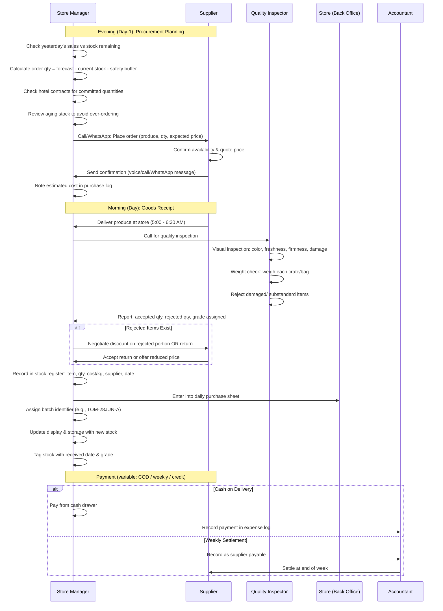

### Key Business Rules
- Order placed by 6 PM day-prior for next-day delivery
- Produce must arrive by 7 AM for morning opening
- 5% weight variance tolerance (above → negotiate; below → accept at reduced cost)
- All incoming batches get quality grade assignment before acceptance
- Batch code format: `{PRODUCE_CODE}-{DDMMM}-{GRADE}` (e.g., TOM-28JUN-A)

### Edge Cases
| Situation | Handling |
|---|---|
| Supplier delivers 30% less than ordered | Emergency PO to backup supplier OR ration across channels (hotel gets priority) |
| Entire batch rejected (quality failure) | No backup = stockout. Activate emergency sourcing from nearest retail competitor |
| Supplier no-show (no call, no delivery) | Emergency mandi run by store staff before 7 AM |
| Price dispute: delivered price > agreed price | Negotiate on the spot; if no resolution, reject delivery, source elsewhere |

---

## 2. INVENTORY WORKFLOW

**Actors**: Store Manager, Sales Staff, Quality Inspector

**Flow**: Stock from receipt through sale or disposal

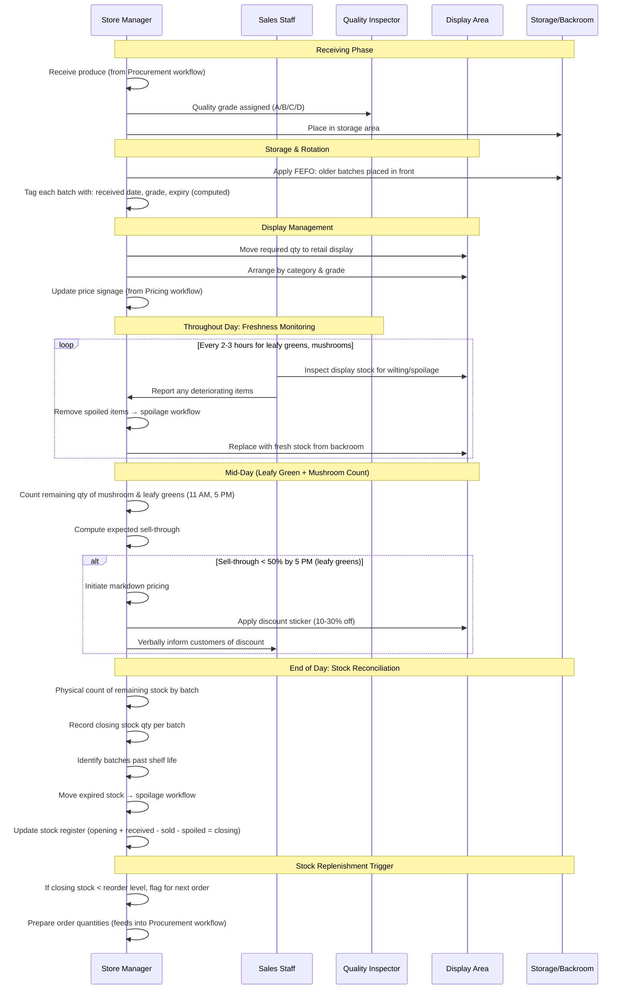

### Batch Flow Visualization

```
┌──────────┐    ┌──────────┐    ┌──────────┐    ┌──────────┐
│ RECEIVED │───→│ STORED   │───→│ DISPLAY  │───→│ SOLD     │
│ (Grade A)│    │ (FEFO)   │    │ (Priced) │    │ (Retail) │
└──────────┘    └──────────┘    └──────────┘    └──────────┘
                      │               │
                      ▼               ▼
               ┌──────────┐    ┌──────────┐
               │TRANSFERRED│    │ MARKDOWN │───→│ SOLD (discounted)
               │(to other)│    │ (aging)  │
               └──────────┘    └──────────┘    ┌──────────┐
                      │               │        │ WASTE    │
                      ▼               └───────→│(expired) │
               ┌──────────┐                     └──────────┘
               │ SOLD     │
               │ (Hotel)  │
               └──────────┘
```

---

## 3. HOTEL ORDER WORKFLOW

**Actors**: Hotel (B2B Customer), Store Manager, Picker, Quality Inspector, Driver, Accountant

**Flow**: End-to-end hotel order lifecycle

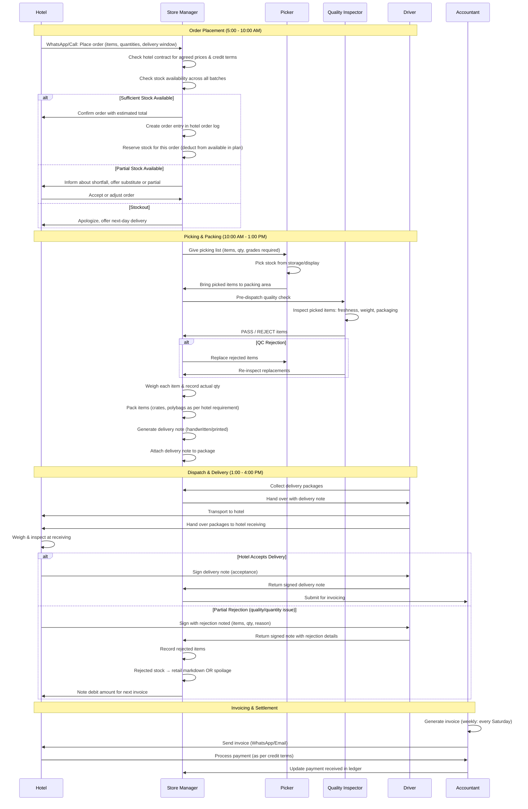

### Order Timeline Constraints

```
Time    Activity                    Cutoff
────────────────────────────────────────────
05:00   Hotel starts ordering       10:00 AM (same-day delivery)
10:00   Order cutoff                10:00 AM
10-11   Picking & QC                Must start by 10:00
11-12   Packing & weighing          12:00 PM
12-13   Dispatch preparation        1:00 PM
13-16   Delivery                    4:00 PM (or as per hotel slot)
16-17   Signed delivery note back   5:00 PM
```

### Edge Cases

| Situation | Handling |
|---|---|
| Hotel orders after 10 AM cutoff | Offer next-day delivery; if urgent, check stock & dispatch at manager's discretion with overtime |
| Hotel rejects entire delivery | Full return → stock goes to retail markdown. Supply suspended for investigation if pattern |
| Driver delayed (traffic/breakdown) | Notify hotel immediately with new ETA. If past hotel receiving hours, reschedule |
| Signed D/Note lost | Ask hotel to re-sign on next delivery; use delivery photo as interim proof |
| Hotel disputes invoice quantity | Cross-check with signed delivery note. If error, issue corrected invoice. If dispute, debit note |

---

## 4. RETAIL BILLING WORKFLOW

**Actors**: Customer, Cashier, Weighing Scale

**Flow**: Walk-in customer purchase from selection to payment

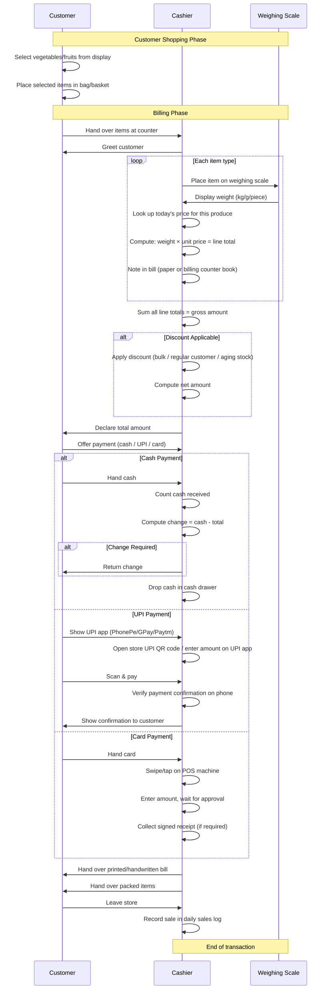

### Billing Log Entry Format

```
Date: 28-Jun-2026 | Cashier: Rajesh | Txn#: R-0284
Items:
  - Tomato (3.2 kg × Rs. 40) = Rs. 128
  - Spinach (0.5 kg × Rs. 60) = Rs. 30
  - Mushroom (0.4 kg × Rs. 240) = Rs. 96
Gross: Rs. 254 | Discount: Rs. 0 | Net: Rs. 254
Payment: UPI (Yes Bank, Ref: UPI284712)
Time: 10:23 AM
```

### Edge Cases

| Situation | Handling |
|---|---|
| Customer disputes weight | Re-weigh in front of customer. If scale discrepancy, check calibration immediately |
| Customer forgets wallet after bagging | Hold items for 15 min; if no return, return stock to display |
| UPI payment fails but shows deducted from bank | Request customer not to re-pay; wait 30 min for auto-refund. If no refund, give phone number for follow-up |
| Price dispute: "Yesterday it was Rs. 30, today Rs. 45" | Explain daily price variation. If regular customer, apply small discount (5%) to retain goodwill |
| Customer wants half-quantity return after billing | No returns accepted once customer leaves counter (except spoilage) |
| Peak hour: long queue | If queue > 5 people, call second cashier (if available) or pre-weigh fast-moving items |

---

## 5. CUSTOMER PAYMENTS WORKFLOW

**Actors**: Customer, Cashier, Accountant

**Flow**: Payment collection, verification, and daily settlement

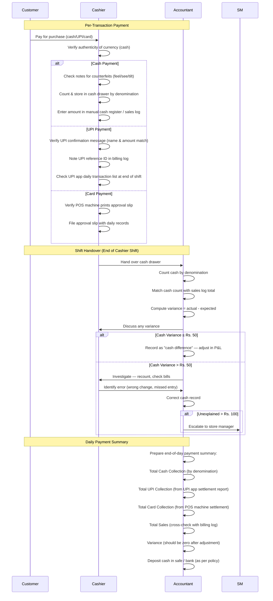

### Payment Mix & Reconciliation

```
Payment Method     Check Source                   Settlement Speed
─────────────────────────────────────────────────────────────────
Cash               Physical count + sales log     Immediate
UPI                UPI app transaction report     T+1 (bank account)
Card               POS machine settlement          T+1 (bank account)

Daily Check: Sum(Cash + UPI + Card) = Total Sales as per billing log
```

### Edge Cases

| Situation | Handling |
|---|---|
| UPI payment settles T+1 but customer asks for refund today | Cannot process; ask customer to wait for auto-refund |
| POS machine fails (no network) | Switch to backup POS or take only cash/UPI |
| Customer pays with damaged/soiled note | Do not accept; politely ask for alternative |
| Cash drawer short at end of day (Rs. 500 missing) | Review CCTV footage. If theft suspected → escalate. If error → adjust |
| UPI app shows extra transaction not in billing log | Could be customer scanned but no sale completed → check billing log for orphan entry |

---

## 6. SUPPLIER PAYMENTS WORKFLOW

**Actors**: Store Manager, Supplier, Accountant

**Flow**: Payment to produce/vegetable suppliers

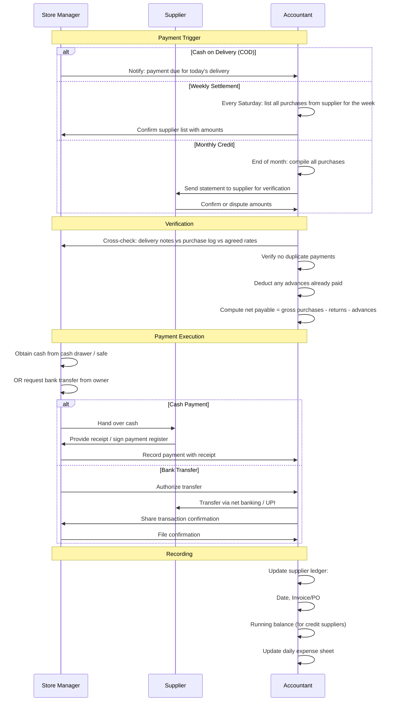

### Edge Cases

| Situation | Handling |
|---|---|
| Supplier asks for advance payment (for large order) | Record as advance; deduct from final settlement. Track in "Advances Paid" register |
| Supplier claims higher rate than agreed | Check purchase order / WhatsApp record. If SM's error, negotiate. If supplier incorrect, hold to agreed rate |
| Multiple invoices, part payment | Track by invoice. Ensure each payment is allocated to specific invoices |
| Supplier wants early payment for discount | Verify discount % vs. cash flow benefit. If ≥ 2% discount for ≤ 7 days early → accept |
| Supplier disputes deduction (returns) | Show signed delivery note with rejection recorded |

---

## 7. EXPENSE ENTRY WORKFLOW

**Actors**: Store Manager, Staff Member, Accountant

**Flow**: Recording all non-procurement operational expenses

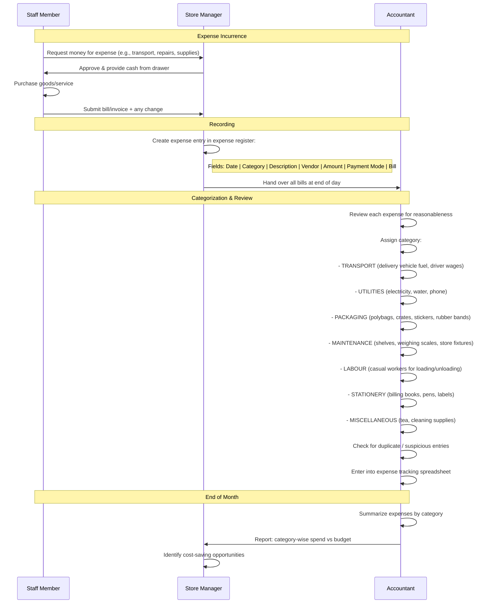

### Expense Categories & Budget Benchmarks

| Category | Typical % of Revenue | Check |
|---|---|---|
| Transport | 2-4% | Fuel receipts vs distance covered |
| Packaging | 1-2% | Polybag usage per sale count |
| Labour | 3-6% | Daily wages vs store traffic |
| Utilities | 0.5-1.5% | Compare month-on-month |
| Maintenance | 0.5-1% | Unexpected spikes = investigate |
| Miscellaneous | 0.5-1% | Cap at 1% without manager approval |

### Edge Cases

| Situation | Handling |
|---|---|
| Staff paid from cash but no bill (e.g., tips, loading/unloading) | Record as "Labour" with note of work done and staff name |
| Expense exceeds Rs. 1000 without prior approval | Flag to owner; require justification. Policy: > Rs. 1000 needs pre-approval |
| Recurring expense (e.g., daily transport) | Create standing entry template to avoid daily re-entry |
| Expense in foreign currency (rare: imported English veg supplies) | Convert to INR at day's exchange rate, note forex rate used |

---

## 8. VEHICLE EXPENSES WORKFLOW

**Actors**: Driver, Store Manager, Accountant, Mechanic

**Flow**: Tracking all costs associated with delivery/transport vehicles

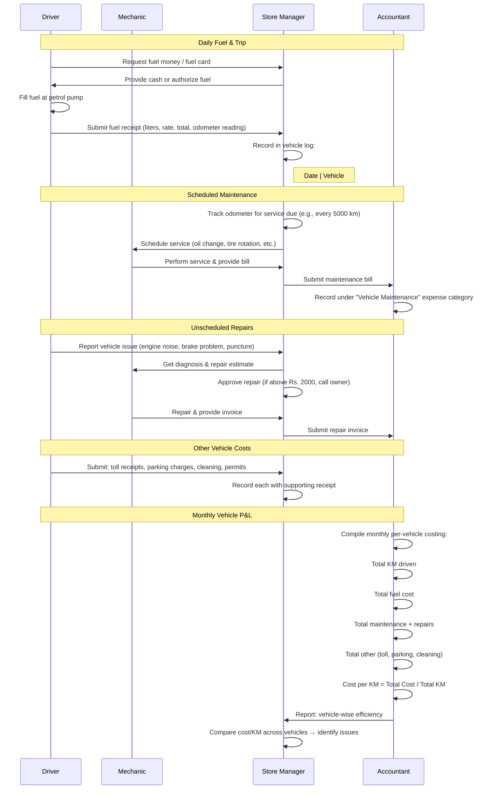

### Vehicle Tracking Sheet

```
Vehicle: UP-78-AB-1234 (Tata Ace)
─────────────────────────────────────────
Date    Odo.Start   Odo.End   KM    Fuel(L)   Cost   Route
─────────────────────────────────────────
28-Jun   12,340     12,410    70      8       Rs. 840  Store→Hotel5→Hotel3→Store
29-Jun   12,410     12,455    45      5       Rs. 525  Store→Hotel1→Hotel2→Store
─────────────────────────────────────────
Service Due: 15,000 km (currently 12,455 km)
Last Service: 10-Apr-2026 (at 10,000 km)
```

### Edge Cases

| Situation | Handling |
|---|---|
| Driver reports fuel consumption far above normal | Check route distance, check for fuel theft (pumping more than tank capacity) |
| Accident / vehicle damage | Record separately under insurance claim. Track out-of-pocket expenses |
| Vehicle breakdown during delivery run | Notify SM → arrange backup vehicle or auto for that delivery |
| Personal use of vehicle by driver | Policy: no personal use. Check odometer vs delivery schedule |
| No receipt (small expense like parking ₹20) | Accept verbal with note; policy: > Rs. 50 needs receipt |

---

## 9. SPOILAGE WORKFLOW

**Actors**: Store Manager, Quality Inspector, Accountant

**Flow**: Detection, recording, root cause analysis of spoiled produce

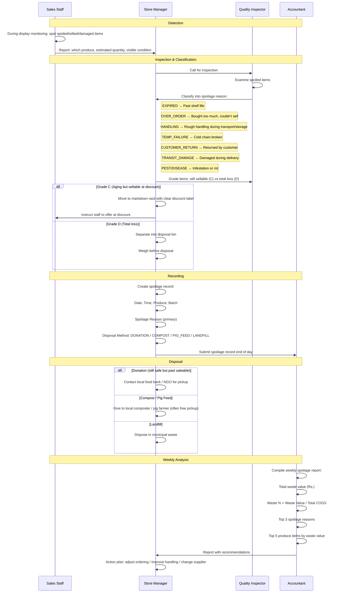

### Target Waste Rates

| Category | Target | Alert Level | Critical |
|---|---|---|---|
| Common vegetables | ≤ 5% | 5-8% | > 8% |
| Leafy greens | ≤ 8% | 8-12% | > 12% |
| English vegetables | ≤ 3% | 3-5% | > 5% |
| Mushrooms | ≤ 5% | 5-8% | > 8% |
| Fruits | ≤ 6% | 6-10% | > 10% |

### Edge Cases

| Situation | Handling |
|---|---|
| Same spoilage reason 3 days in a row | Mandatory manager review meeting — systemic issue |
| Massive spoilage (e.g., power outage killed all cold storage) | Emergency: photograph evidence, record total loss, insurance claim (if covered) |
| Customer returns spoiled item — was it spoiled when sold or after? | If > 50% of item is spoiled → refund; if slight → check if customer stored wrong |
| Staff trying to hide spoilage (mixing bad with good) | Train staff; policy: spoilage is expected, hiding it is not. Surprise audits |
| Donation partner not showing up | If scheduled pickup missed, switch to compost to avoid pest issues |

---

## 10. RETURNS WORKFLOW

**Actors**: Customer, Cashier, Store Manager

**Flow**: Customer returning purchased produce for refund/replacement

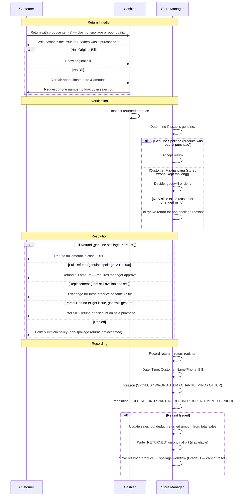

### Return Policy Summary

| Scenario | Refund? | Condition |
|---|---|---|
| Produce spoiled on purchase day | Full refund | Original bill required; > Rs. 50 needs manager OK |
| Produce spoiled next day | Depends | Leafy greens = deny (1-day life); potato = partial |
| Customer bought wrong item | Deny (change mind) | Exception: exchange if returned within 30 min unused |
| Customer claims short weight | Re-weigh | If our scale was wrong → refund difference |
| Regular customer, no bill, small amount (≤ Rs. 30) | Goodwill refund | Trusted customer, no questions asked |
| Same customer returning frequently | Flag | Investigate pattern — possible abuse |

### Edge Cases

| Situation | Handling |
|---|---|
| Customer returns produce purchased at different store (chain) | Accept if other store in same chain; adjust in inter-store settlement |
| Customer becomes aggressive when return denied | De-escalate: offer small discount (Rs. 10-20) to defuse; involve owner if needed |
| Returned produce is only partly spoiled | Full refund on whole item — policy: customer shouldn't sort good from bad |
| Customer asks to return without item ("I threw it away") | Deny — must see the item to verify |
| Employee-related return (staff gave wrong item/weight) | Full refund + apology → investigate staff training gap |

---

## 11. STOCK TRANSFER WORKFLOW

**Actors**: Source Store Manager, Destination Store Manager, Driver, Accountant

**Flow**: Inter-store transfer of excess/aging stock to where it's needed

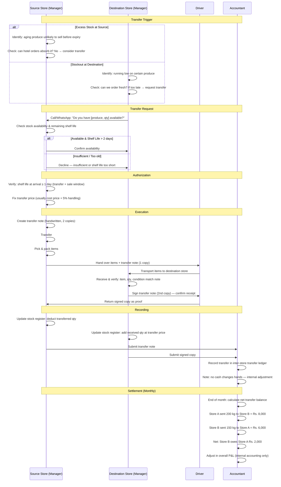

### Transfer Decision Matrix

```
Source Stock Age      Destination Distance     Decision
──────────────────────────────────────────────────────────
> 80% shelf life      Any                      DON'T TRANSFER — too risky
50-80% shelf life     < 5 km                   TRANSFER (can sell same day)
50-80% shelf life     5-15 km                  TRANSFER with fast delivery
< 50% shelf life      Any distance             TRANSFER (good rotation)
```

### Edge Cases

| Situation | Handling |
|---|---|
| Items damaged in transit during transfer | Source store bears loss (since they picked). Record as transit waste |
| Destination store claims wrong quantity received | Cross-check signed transfer note. If discrepancy, reconcile |
| No vehicle available for transfer | Use auto-rickshaw for small qty (< 50 kg); batch with delivery run if aligned |
| Same-day transfer needed urgently | Use priority transport (motorcycle/courier) for small urgent qty |
| Transfer between stores with different pricing | Transfer at cost price; destination applies its own retail margin |

---

## 12. MULTI-SHOP WORKFLOW

**Actors**: Owner/Regional Manager, Store Manager (Store A), Store Manager (Store B), Central Accountant

**Flow**: Coordination, reporting, and decision-making across multiple store locations

```mermaid
sequenceDiagram
    participant OWN as Owner / Regional Manager
    participant SMA as Store Manager (Store A)
    participant SMB as Store Manager (Store B)
    participant CAC as Central Accountant

    Note over OWN,CAC: Daily Morning (8:00 AM)
    SMA->>OWN: WhatsApp: "Opening stock, today's prices set, any special instructions?"
    SMB->>OWN: WhatsApp: same
    OWN->>OWN: Note key differences: pricing, stock issues

    Note over OWN,CAC: Centralized Procurement Coordination
    alt Combined Order (top 20 common items)
        SMA->>CAC: Send expected qty needed for tomorrow
        SMB->>CAC: Send expected qty needed for tomorrow
        CAC->>CAC: Consolidate: Total qty = Store A + Store B + Buffer
        CAC->>SMA: Notify: "We're ordering X kg — your share is Y kg"
        CAC->>SMB: Notify: same
        CAC->>S: Place single bulk order at negotiated rate
        S->>CAC: Confirm delivery — split at source (pre-sorted for each store)
    else Store-Specific Items (each store orders independently)
        SMA->>SMA: Order independently
        SMB->>SMB: Order independently
    end

    Note over OWN,CAC: Mid-Day Coordination
    SMA->>OWN: "Running low on spinach — any spare?"
    OWN->>SMB: "Store A needs spinach — can you transfer?"
    SMB->>OWN: "I have 5 kg extra — can send"
    OWN->>SMA: "Transfer coming from Store B — 5 kg spinach"
    (Initiates Stock Transfer Workflow)

    Note over OWN,CAC: End of Day Reporting (8:00 PM)
    SMA->>CAC: Send daily flash report:
    CAC->>SMA: acknowledged
    SMB->>CAC: Send daily flash report:
    CAC->>SMB: acknowledged

    Note over OWN,CAC: Daily Flash Report Format

    Note right of CAC: Store: A | Date: 28-Jun-2026
    Note right of CAC: Sales: Rs. 28,450
    Note right of CAC: Purchases: Rs. 18,200
    Note right of CAC: Waste: Rs. 1,100 (3.9%)
    Note right of CAC: Cash: Rs. 12,300 | UPI: Rs. 13,150 | Card: Rs. 3,000
    Note right of CAC: Expenses: Rs. 1,200
    Note right of CAC: Gross Margin: Rs. 9,950 (35%)

    Note over OWN,CAC: Weekly Review (Sunday)
    CAC->>OWN: Compile weekly dashboard:
    CAC->>OWN:   Store-wise: Revenue, Margin %, Waste %, Top SKUs
    CAC->>OWN:   Combined: Total revenue, total margin
    CAC->>OWN:   Comparison: Store A vs Store B (who performed better?)
    OWN->>OWN: Identify:
    OWN->>OWN:   - Store A: higher margin, lower waste → best practices to share
    OWN->>OWN:   - Store B: higher revenue, but higher waste → investigate
    OWN->>OWN:   - Combined purchasing power increase = better supplier rates

    Note over OWN,CAC: Cross-Store Decisions
    OWN->>SMA: "Implement Store B's display layout — they sell more English veg"
    OWN->>SMB: "Adopt Store A's morning ordering routine to reduce waste"
    OWN->>CAC: "Negotiate with Supplier X for both stores — volume discount potential"
```

### Weekly Multi-Store Dashboard

```
WEEK 26 (22-28 Jun 2026)
────────────────────────────────────────────────────────────
Metric              Store A      Store B      Combined
────────────────────────────────────────────────────────────
Revenue             Rs. 1,89,000 Rs. 2,12,000 Rs. 4,01,000
COGS                Rs. 1,17,180 Rs. 1,35,680 Rs. 2,52,860
Gross Margin        Rs. 71,820   Rs. 76,320   Rs. 1,48,140
Margin %            38.0%        36.0%        36.9%
Waste %             4.1%         6.2%         5.2%
Total SKUs Sold     82           78           94
Top SKU (Rev)       Tomato       Onion        Tomato
Expenses            Rs. 8,600    Rs. 9,400    Rs. 18,000
Net Profit          Rs. 63,220   Rs. 66,920   Rs. 1,30,140
────────────────────────────────────────────────────────────
```

### Edge Cases

| Situation | Handling |
|---|---|
| One store has much higher waste than others | Root cause investigation: is it ordering practice, storage, or customer base? |
| Store managers compete rather than cooperate | Owner sets policy: transfers are mandatory for common good. Measure cooperation in review |
| Pricing differs across stores for same item | Allow regional pricing variation (different catchment areas). But cap difference at 10% to avoid brand confusion |
| Owner can't be online all day | Designate Regional Manager or use daily fixed-time check-ins (8 AM, 8 PM) |
| New store opening | Assign experienced SM from existing store for 2 weeks to transfer SOP knowledge |

---

## 13. CHEQUE LIFECYCLE WORKFLOW

**Actors**: Customer/Hotel (Payer), Store Manager, Accountant, Bank

**Flow**: Receiving, depositing, clearing, and handling cheques

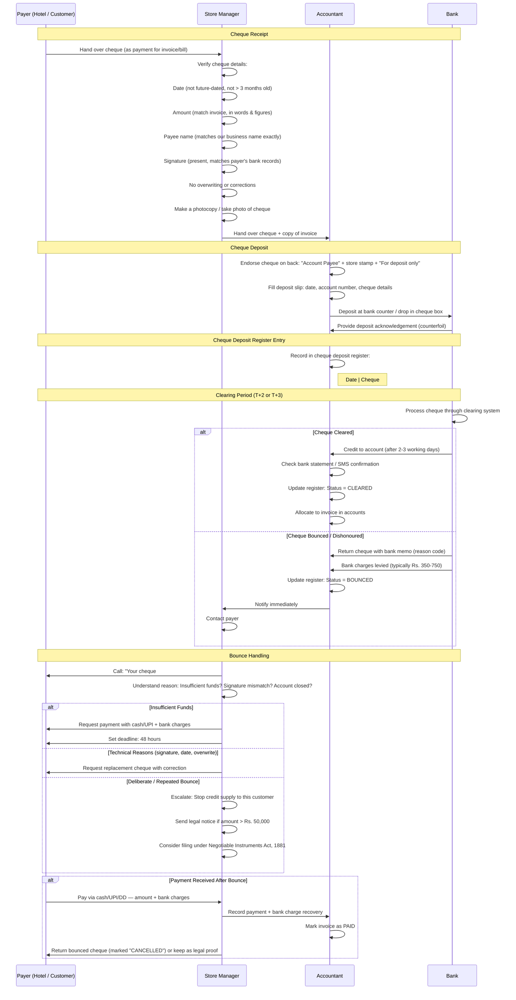

### Cheque Acceptance Policy

| Payer Type | Cheque Limit | Condition |
|---|---|---|
| New hotel account | No cheques for 1st month | Cash/UPI only |
| Established hotel (>3 months) | Up to Rs. 50,000 | One cheque per invoice |
| Premium hotel (>1 year, good history) | Up to Rs. 2,00,000 | Post-dated cheques accepted for future dates |
| Retail customer | No cheques accepted | Cash/UPI/Card only |
| Corporate customer (one-time large order) | Up to Rs. 25,000 | With manager approval |

### Cheque Register

```
CHEQUE DEPOSIT REGISTER — June 2026
──────────────────────────────────────────────────────────────────────────
Dep#  Date    Cheque#  Bank     Drawee     Amount  Status    ClearDate
──────────────────────────────────────────────────────────────────────────
C045  20-Jun  587412   HDFC    Hotel Taj  ₹28,450 CLEARED   23-Jun
C046  22-Jun  891234   ICICI   Hotel Rad  ₹15,000 BOUNCED   —
C047  24-Jun  345678   SBI     Hotel Mar  ₹42,000 PENDING   —
──────────────────────────────────────────────────────────────────────────
```

### Edge Cases

| Situation | Handling |
|---|---|
| Post-dated cheque (future date) | Do not deposit before date. In diary: reminder for deposit date |
| Cheque from third party (not the hotel account holder) | Do not accept — must be from account holder's own cheque |
| Lost cheque (customer claims issued, we never received) | Ask customer to issue stop-payment and reissue |
| Cheque amount in words & figures differ | Do not accept — bank will reject. Ask for corrected cheque |
| Customer requests to take back cheque (wants to pay cash instead) | Return only if cancelled / marked "CANCELLED" and signed by us |

---

## 14. CREDIT SETTLEMENT WORKFLOW

**Actors**: Hotel (B2B Customer), Store Manager, Accountant

**Flow**: Managing credit sales, invoicing, payment collection, and overdue handling

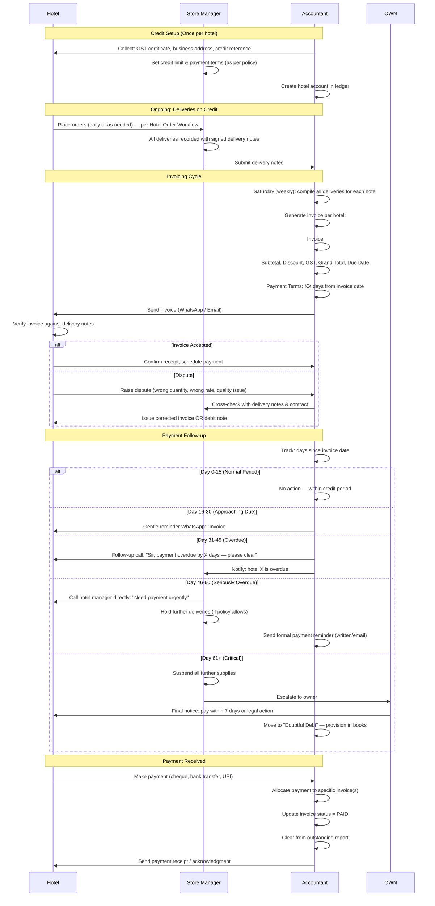

### Credit Policy Matrix

| Hotel Monthly Volume | Credit Limit | Credit Period | Max Outstanding |
|---|---|---|---|
| < Rs. 30,000 | Rs. 15,000 | 7 days | Rs. 7,500 |
| Rs. 30,000 - 75,000 | Rs. 50,000 | 15 days | Rs. 37,500 |
| Rs. 75,000 - 1.5 Lakh | Rs. 1,00,000 | 30 days | Rs. 1,00,000 |
| > Rs. 1.5 Lakh | Rs. 2,00,000 | 45 days | Rs. 2,25,000 |

### Outstanding Aging Report

```
HOTEL OUTSTANDING AGING — as of 28-Jun-2026
─────────────────────────────────────────────────────────────────
Hotel       Total     0-15d     16-30d    31-45d    46+ d    Status
─────────────────────────────────────────────────────────────────
Hotel Taj   ₹28,450   ₹28,450   —         —         —        OK
Hotel Rad   ₹45,000   ₹15,000   ₹30,000   —         —        Follow up
Hotel Mar   ₹62,000   —         ₹20,000   ₹42,000   —        ⚠️ Overdue
Hotel Bay   ₹15,000   —         —         —         ₹15,000  🔴 SUSPENDED
─────────────────────────────────────────────────────────────────
Total      ₹1,50,450  ₹43,450   ₹50,000   ₹42,000   ₹15,000
─────────────────────────────────────────────────────────────────
```

### Edge Cases

| Situation | Handling |
|---|---|
| Hotel makes part payment | Allocate to oldest invoice first. Track partial payment against invoice |
| Hotel requests credit period extension | Evaluate relationship & history. If strong → extend 15 days once. Document approval |
| Hotel disputes invoice after 2 weeks | If genuine error → correct. If delay tactic → hold firm, reference signed delivery notes |
| Hotel closes down / stops operations | Write off as bad debt. File as business loss for tax. Review credit assessment process |
| Hotel pays but complains about quality from past deliveries | Accept feedback, offer discount on next order, but do not reduce past invoice amount after payment |
| Owner's friend/family hotel — wants special credit terms | Policy applies to everyone. Exception only with owner's written approval |

---

## 15. CLOSING PROCESS WORKFLOW

**Actors**: Cashier, Store Manager, Accountant

**Flow**: End-of-day procedures — financial, inventory, administrative close

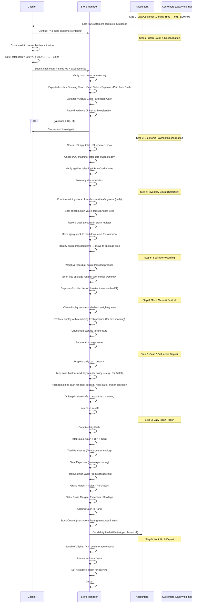

### Daily Flash Report Template

```
─────────────────────────────────────
DAILY FLASH — Store A
Date: 28-Jun-2026 | Prepared by: Rajesh
─────────────────────────────────────
SALES:
  Cash:     ₹ 18,250
  UPI:      ₹ 12,400
  Card:     ₹  3,100
  ─────────────────
  TOTAL:    ₹ 33,750

PURCHASES:  ₹ 21,500
EXPENSES:   ₹  1,200

SPOILAGE:
  Qty:      3.5 kg
  Value:    ₹    480  (1.4% of sales)
  Top item: Spinach (2 kg)

GROSS MARGIN: ₹ 12,250 (36.3%)
NET MARGIN:   ₹ 10,570 (31.3%)

CASH POSITION:
  Opening Float:  ₹  5,000
  Cash Collected: ₹ 18,250
  Expenses Paid:  ₹  1,200
  Closing Cash:   ₹ 22,050
  (Float for tomorrow: ₹ 5,000)
─────────────────────────────────────
```

### Edge Cases

| Situation | Handling |
|---|---|
| Closing cash doesn't match by > Rs. 100 | Do not leave until discrepancy found. Review CCTV if needed |
| UPI settlement not received by closing time | Note expected amount; reconcile next day when settlement arrives in bank |
| Large spoilage discovered at closing | Photograph, record, investigate root cause before disposing |
| Customer comes 5 min after closing | Policy: "Closed" sign out. If elderly/regular, accommodate once but note |
| Door lock broken / security issue | Do not leave store unattended. Call owner for instructions |

---

## 16. OPENING PROCESS WORKFLOW

**Actors**: Store Manager, Cashier, Sales Staff

**Flow**: Morning procedures — preparing store for daily operations

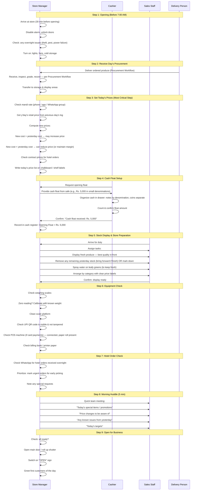

### Morning Opening Checklist

| ✓ | Time | Task | Done By |
|---|---|---|---|
| ☐ | 6:30 AM | Arrive, disable alarm, turn on utilities | SM |
| ☐ | 6:45 AM | Receive & inspect procurement delivery | SM |
| ☐ | 6:50 AM | Log procurement in stock register | SM |
| ☐ | 7:00 AM | Set today's prices (mandi check + compute) | SM |
| ☐ | 7:05 AM | Cashier: receive float & set up cash drawer | CA |
| ☐ | 7:10 AM | Display fresh produce, remove old stock | SS |
| ☐ | 7:15 AM | Check & calibrate scales | SM |
| ☐ | 7:20 AM | Check UPI POS billing readiness | CA |
| ☐ | 7:25 AM | Review overnight hotel orders | SM |
| ☐ | 7:30 AM | Morning huddle (5 min) | All |
| ☐ | 7:35 AM | Open store | SM |

### Price Setting Logic (Morning)

```
Today's Cost (C_today) = Price paid to supplier this morning
Yesterday's Cost (C_yest) = Price paid yesterday
Yesterday's Retail (R_yest) = Selling price yesterday
Target Margin (M) = Per-category minimum (20-40%)

Decision:
  IF C_today >= C_yest THEN
    R_today = C_today × (1 + M)
  ELSE (C_today < C_yest)
    Option A: R_today = R_yest (maintain price, higher margin today)
    Option B: R_today = C_today × (1 + M) (lower price, competitive)

For Hotel Contract Items:
  R_hotel = R_today × (1 - Contract Discount%)
  (BUT cannot exceed contract's agreed ceiling price)
```

### Edge Cases

| Situation | Handling |
|---|---|
| Mandi rate not yet available at 7 AM | Use yesterday's cost + 5% buffer. Adjust price once rate arrives |
| Weighing scale not working (no backup) | Use backup manual scale. If none → urgent purchase from nearest shop |
| Delivery hasn't arrived by 7 AM | Open with yesterday's remaining stock. Call supplier for ETA |
| Cashier calls in sick | SM or trained backup staff operates cash counter |
| Power cut (no lights, no cold storage) | Open if enough natural light. Transfer temp-sensitive stock to ice boxes. Priority: fix electricity |
| Yesterday's stock still significant | Heavy markdown first thing. Display new stock behind old to push old stock first |
| Staff not reporting on time | SM + available staff manage; call backup |
| UPI app not working / QR code tampered | Use backup printed QR code. If none, accept only cash until fixed |

---

## Process Dependency Map

```
OPENING (7 AM)
  │
  ├── Procurement (receives delivery)
  ├── Pricing (sets today's rates)
  ├── Cash Setup (float ready)
  ├── Display Setup (store ready)
  └── Hotel Order Review
        │
  ┌─────┴──────────────────────────────────────┐
  │                                            │
  ▼                                            ▼
RETAIL SALES (7:30 AM - 8 PM)          HOTEL ORDER PROCESSING (10 AM - 1 PM)
  │                                            │
  ├── Customer Billing ◄── Pricing              ├── Order Picking ◄── Inventory
  ├── Customer Payments                        ├── QC Check ◄── Quality
  │    ├── Cash                                ├── Dispatch
  │    ├── UPI                                 └── Delivery ◄── Logistics
  │    └── Card                                      │
  ├── Returns ◄── Spoilage                          ▼
  │                                            HOTEL DELIVERY (1-4 PM)
  └── Stock Monitoring ◄── Inventory                 │
        │                                            ├── Acceptance
        ├── Markdown                                 └── Rejection
        ├── Transfers (inter-store)                       │
        └── Spoilage Recording                           ▼
              │                                   INVOICING (Weekly)
              ▼                                     │
        DISPOSAL                                    ▼
                                             CREDIT SETTLEMENT
                                               │
  ┌────────────────────────────────────────────┤
  │                                            │
  ▼                                            ▼
CLOSING (8 PM)                           SUPPLIER PAYMENT (COD/Weekly)
  │
  ├── Cash Reconciliation ◄── Payments
  ├── Inventory Count ◄── Stock
  ├── Spoilage Recording
  ├── Daily Flash Report
  └── Store Secured

(Next day loops back to OPENING)
```
